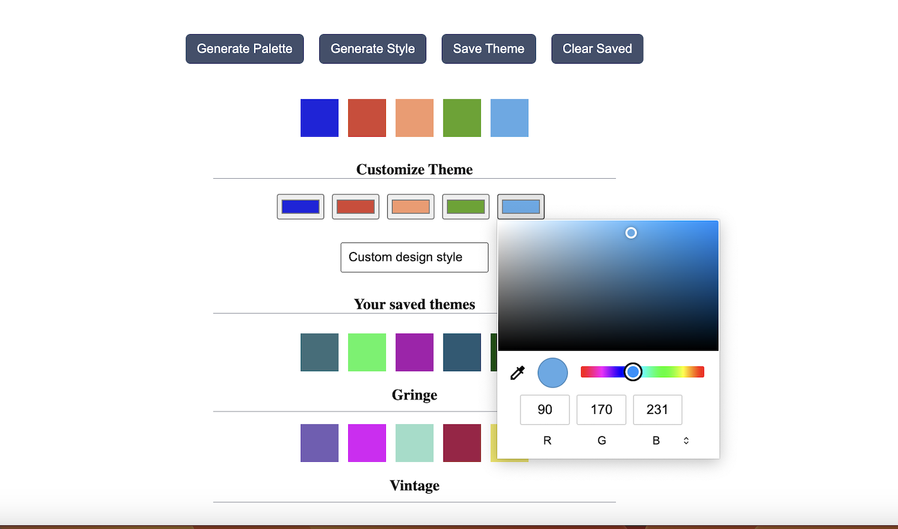

# Random Theme Generator Extension

- This is a 3rd party extension for Adobe Illustrator

### Dev Requirements

- [Node.js](https://nodejs.org/en) 16 or later
- [Yarn](https://yarnpkg.com/getting-started/install)
- Install Adobe Illustrator in you machine if you don't have

## Features

- Random color pallete generator
- Random Design Style generator
- Saving and customizing generated design and color palette

## how to  install

- First, click on download [download extention](https://github.com/Levy-Naibei/RTG/tags) to download extension zip file
- Extract the zxp file from archive
- install extension manager [extension manager](http://install.anastasiy.com/)

## how to use extension

- link to the video will be added here

## Author

- Levy Naibei
